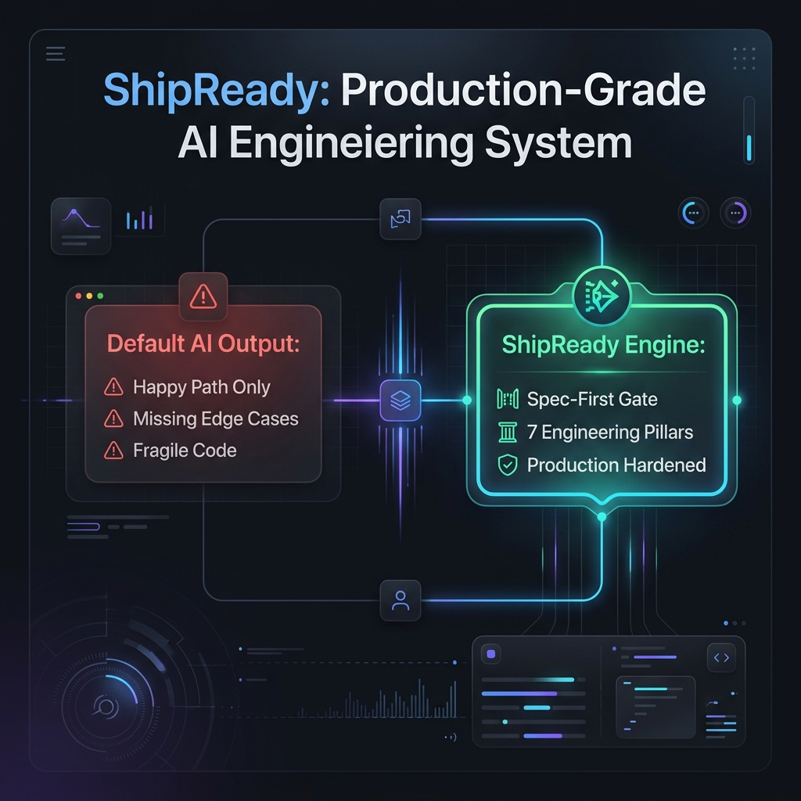
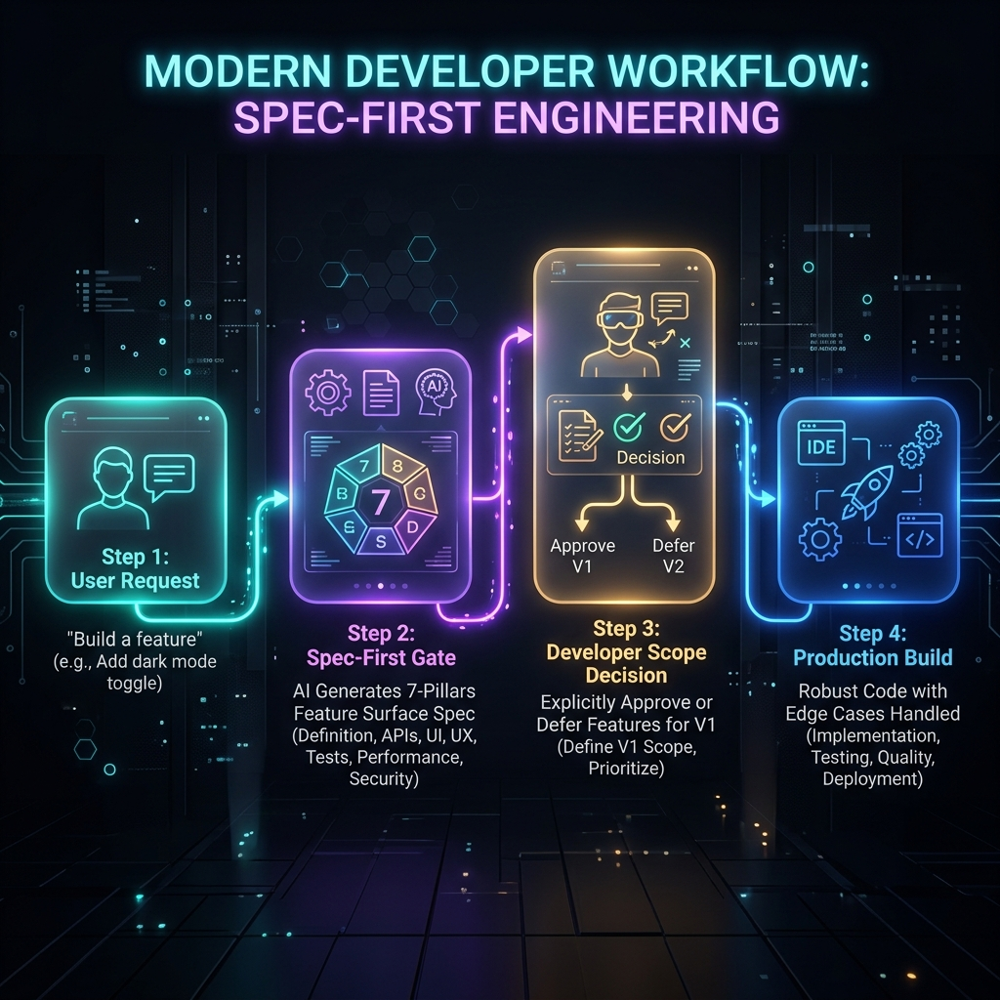
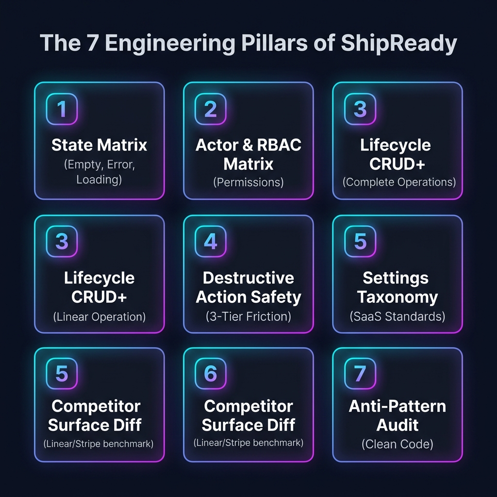

<div align="center">

# 🚀 ShipReady

### *The Spec-First Constraint Engine for Production-Grade AI Engineering*

[](LICENSE)
[](https://github.com/Dheerax/ship-ready)
[](https://github.com/Dheerax/ship-ready)
[](https://github.com/Dheerax/ship-ready)

<br/>



</div>

---

## 💡 Why ShipReady Exists

When asked to build a feature, AI coding assistants (Claude, ChatGPT, Cursor) naturally default to the **Happy Path**—the primary user flow that works under ideal conditions. While this produces impressive 5-minute prototypes, it fails in production.

Production-grade software (like GitHub, Stripe, Linear, and Vercel) feels reliable not because a larger model built it, but because it explicitly handles **thousands of edge cases** discovered over years of user feedback.

As a solo engineer or small team, **ShipReady acts as your automated senior engineering proxy**. It forces AI models to systematically map out and design for every UI state, permission layer, lifecycle action, and safety guardrail **before writing a single line of feature code**.

---

## ⚡ The Spec-First Gate Workflow

ShipReady installs a strict **"Spec-First Gate"** inside the model's instruction loop. The AI is explicitly **blocked** from outputting feature code until it generates a structured **Feature Surface Spec** for developer review.



> **Key Advantage:** Scope becomes an **explicit choice** you approve or defer, rather than an **accidental gap** neither you nor the AI noticed.

---

## 🏛️ The 7 Engineering Pillars

Every proposed feature is evaluated against **seven core architectural dimensions**:



<br/>

| Pillar | Focus Area | What it Hardens |
| :--- | :--- | :--- |
| **1. State Matrix 📊** | UI Resilience | Guarantees handling for **Empty**, **Loading**, **Error** (network, validation, server), **Partial Data**, **Permission Denied**, and **Zero Results**. |
| **2. Actor & RBAC Matrix 🔑** | Multi-Tenant Safety | Maps interactions across **Owners, Admins, Members, Viewers, Guests**, and handles mid-session role revocations. |
| **3. Lifecycle Completeness 🔄** | Full CRUD+ Operations | Expands basic "Create & List" into **Create, Read, Update, Delete, Archive, Restore, Duplicate, Rename, Export, and Transfer**. |
| **4. Action Safety ⚠️** | Data Loss Friction | Enforces a **3-Tier Friction Model**: Undo Toasts (Tier 1), Dialogs (Tier 2), and Hard Type-to-Confirm (Tier 3). |
| **5. Settings Taxonomy ⚙️** | SaaS Architecture | Maps feature implications across **Account, Security, Billing, Team, Notifications, and Danger Zones**. |
| **6. Competitor Surface Diff ⚖️** | Usability Benchmarking | Compares proposed surface against 1–2 real-world industry leaders (Linear, Stripe, GitHub) to spot UX gaps. |
| **7. Anti-Pattern Audit 🚫** | AI Code Smell Protection | Final pass to eliminate missing field validation, unpaginated tables, unhandled promise rejections, and vanishing toasts. |

---

## 📂 Repository Structure & Reference Guides

```
ship-ready/
├── SKILL.md                          # Main system prompt & gate configuration
├── README.md                         # Product documentation & overview
├── assets/                           # Infographics & visual diagrams
│   ├── hero-banner.png
│   ├── 7-pillars.png
│   └── workflow.png
└── references/                       # Detailed engineering pattern specs
    ├── state-matrix.md               # 7-State UI recipes & code snippets
    ├── actor-permission-matrix.md    # Multi-tenant RBAC edge-case checks
    ├── lifecycle-crud.md             # Entity CRUD+ complete lifecycle matrix
    ├── destructive-actions-safety.md # 3-Tier friction safety implementation
    ├── settings-taxonomy.md          # Standard SaaS settings mapping guide
    ├── competitor-diffing.md         # Framework for diffing against real apps
    └── anti-patterns.md              # Production-grade vs demo code audit
```

---

## 🚀 Quick Start & Integration

### 1. Claude Projects / Custom GPTs
Upload `SKILL.md` and the `references/` directory into your project files or knowledge base, and set `SKILL.md` as core instructions.

### 2. Cursor / Windsurf / Copilot
Copy `SKILL.md` into your workspace rules (e.g. `.cursorrules`, `.windsurfrules`, or `.github/copilot-instructions.md`).

### 3. Execution Trigger
When starting any feature build, simply command:
```bash
"Load ship-ready skill and generate the Feature Surface Spec before coding."
```

---

## ⚖️ Calibration: Scope Control vs. Feature Creep

ShipReady is designed for **visibility**, not over-engineering.

The spec brings edge cases to light so you can make informed decisions. If a full audit log or transfer flow is unnecessary for your v1 release, simply mark it as **`[Deferred for V1]`** in the spec and proceed with a clean, tightly scoped build.

---

<div align="center">

*Built for engineers who want to ship software that feels solid from Day 1.*

</div>
