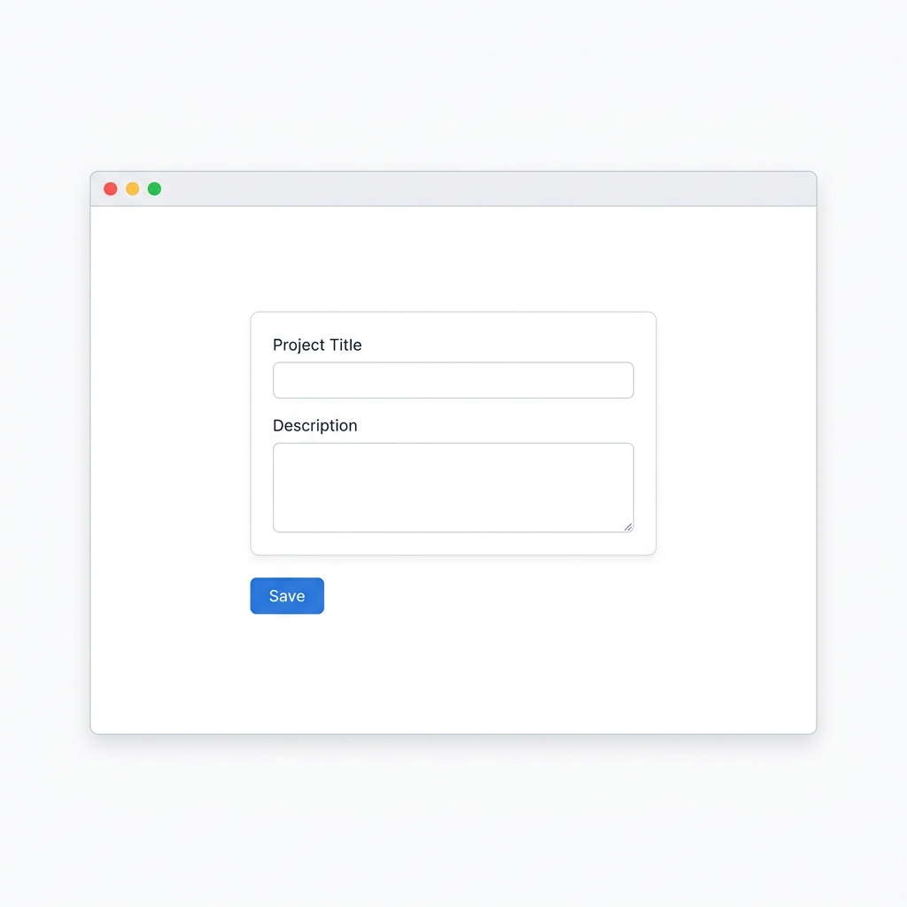
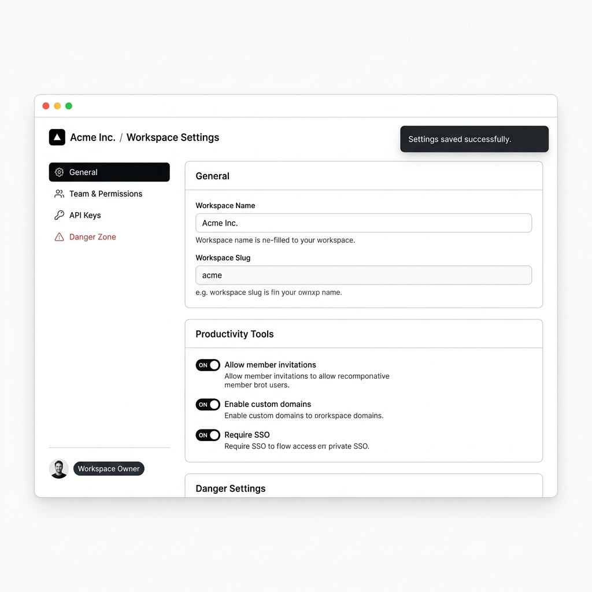

# ShipReady 🚀

**A Spec-First Constraint Engine for AI-Assisted Software Engineering**

ShipReady is a lightweight constraint framework that forces AI coding assistants (Claude, Cursor, ChatGPT, Windsurf) to design and output **production-ready, edge-case-hardened software** instead of default happy-path prototypes.

---

## 📸 The Difference in Practice

When asked to "build a settings page", AI models default to barebones prototypes that lack real-world software depth. ShipReady acts as a programmatic senior engineering proxy, forcing the AI to enumerate all UI states, permissions, and security guardrails before writing code.

| Without ShipReady (Default AI Output) | With ShipReady (Production-Grade Depth) |
| :---: | :---: |
|  |  |
| ⚠️ **Stale & Fragile:** 2 input fields, happy-path only, zero error handling, no roles, missing CRUD operations. | ✅ **Production-Grade:** Full navigation taxonomy, RBAC permissions, 7 UI states, soft/hard deletion safety. |

---

## ⚡ How It Works: The Spec-First Gate

ShipReady installs a strict **"Spec-First Gate"** in your AI assistant's system prompt:

1. **Gate Trigger:** The AI is **blocked** from outputting feature code immediately.
2. **Surface Enumeration:** The AI presents a compact **Feature Surface Spec** covering 7 core engineering pillars.
3. **Explicit Scope Control:** You review the spec, choose what is in scope for `v1`, and explicitly defer the rest.
4. **Execution:** The AI builds the feature with all approved edge cases, states, and guardrails pre-planned.

---

## 🏛️ The 7 Engineering Pillars

Every feature requested under ShipReady is evaluated across seven architectural dimensions:

### 1. State Matrix 📊
Guarantees every screen handles more than just success:
* **Empty States:** Guidance and call-to-actions before data exists.
* **Loading States:** Skeletons, disabled buttons, and active indicators.
* **Error States:** Explicit handling for network failures, validation errors, and server crashes.
* **Partial & Zero-Results:** Single-item grids and filtered empty states.

### 2. Actor & Permission Matrix 🔑
Defines multi-tenant access control and boundary checks:
* Role mapping (**Owner**, **Admin**, **Member**, **Viewer**, **Guest**).
* Handles mid-session role revocations and permission denied states.

### 3. Lifecycle & CRUD Completeness 🔄
Expands simple "Create & List" features into complete SaaS entities:
* **Full CRUD+:** Create, Read, Update, Delete, Archive, Restore, Duplicate, Rename, Export, and Transfer Ownership.

### 4. Destructive Action Safety ⚠️
Prevents accidental data loss with a **3-Tier Friction Model**:
* **Tier 1:** Undo toasts for non-destructive actions.
* **Tier 2:** Confirmation dialogs for item removals.
* **Tier 3:** Type-to-confirm inputs for permanent deletions or transfers.

### 5. Settings Taxonomy Check ⚙️
Integrates features seamlessly into standard SaaS categories:
* Maps implications across **Account**, **Security**, **Notifications**, **Billing**, **Team**, and **Danger Zone**.

### 6. Competitor Surface Diff ⚖️
Directly benchmarks proposed features against top-tier applications (e.g. Stripe, Linear, GitHub) to spot missing usability details.

### 7. Anti-Pattern Audit 🚫
A pre-execution sanity check eliminating common AI code smells:
* Ensures field-level validation, button loading locks, table pagination, and persistent undo windows.

---

## 📂 Repository Structure

```
ship-ready/
├── SKILL.md                          # Core prompt & gate configuration
├── README.md                         # Main documentation
├── assets/                           # Light-mode visual UI comparisons
│   ├── stale-ui.png                  # Default AI output example
│   └── production-ui.png             # ShipReady-enhanced output example
└── references/                       # Engineering checklists & recipes
    ├── state-matrix.md               # 7-State UI patterns & code templates
    ├── actor-permission-matrix.md    # Multi-tenant RBAC edge-case checks
    ├── lifecycle-crud.md             # Full CRUD+ entity operations matrix
    ├── destructive-actions-safety.md # 3-Tier friction safety implementation
    ├── settings-taxonomy.md          # SaaS settings category mapping
    ├── competitor-diffing.md         # Framework for diffing against real apps
    └── anti-patterns.md              # Production code quality audit list
```

---

## 🚀 Usage Instructions

### 1. Cursor / Windsurf / Copilot
Add the contents of `SKILL.md` to your workspace rule configuration (e.g., `.cursorrules`, `.windsurfrules`, or project instructions).

### 2. Custom GPTs / Claude Projects
Include `SKILL.md` and the `references/` folder in your project files / knowledge base.

### 3. Prompting
To trigger the framework during feature development, simply say:
> *"Load ship-ready skill and generate the Feature Surface Spec before writing code."*

---

## ⚖️ Calibration: Visibility Over Bloat

ShipReady is built to give you **visibility**, not force over-engineering. 

By enumerating edge cases early, scope becomes a **conscious choice** you approve or defer (`[Deferred for V1]`), rather than an unnoticed gap in your product.
